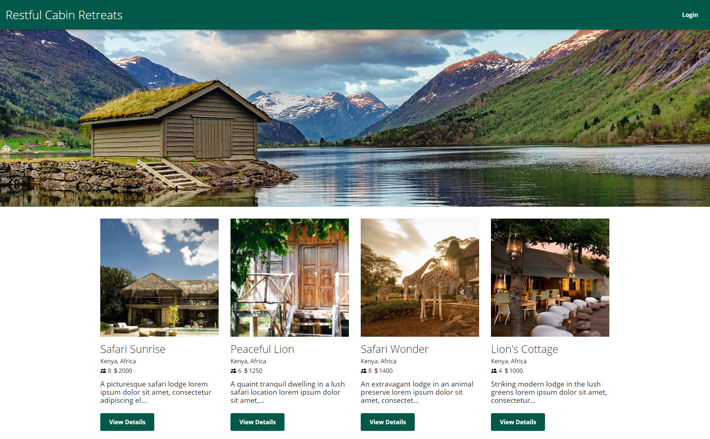
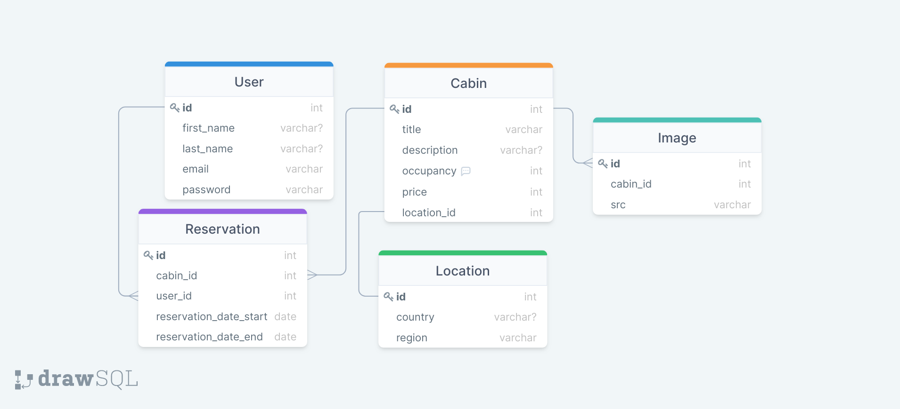

# Project 2: RESTful Cabin Retreats


<!-- image credit: this image is from icons8-->

## Team Members
The members of our team (Group B) include: Oleksandr Kulyk, Scott Geleas, and Nicole Daruwalla.

  ## Table of Contents
  - [Description / Objective](#description--objective)
  - [Links](#links)
  - [Screen Capture](#screen-capture)
  - [Project Requirements](#project-requirements)
  - [User Story](#user-story)
  - [Key Features](#key-features)
  - [Entity Relationship Diagram](#entity-relationship-diagram)
  - [Tools](#tools)
  - [Installation](#installation)
  - [Use](#use)
  - [License](#license)
  - [Contributors](#contributors)
  - [References](#references)
  - [Questions](#questions)

  ## Description / Objective
  Our team created the RESTful Cabin Retreats application to demonstrate our ability to design, build and deploy a full-stack web application to Heroku. The application is in designed and built app using the MVC paradigm, our own server-side API, add user authentication, and database connection. We collaborated via Zoom and Slack, used Git branching workflow and Agile software development methodology.

  ## Links

  ### Github Repository 
  [Project 2: RESTful Cabin Retreats](https://github.com/scottgeleas/Restful-Cabin-Retreats)

  ### Heroku Link 
  [Project 2: RESTful Cabin Retreats](https://restful-cabin-retreats.herokuapp.com/)

  ## Screen Capture
  This capture depicts our application's homepage.
  
  

  ## Project Requirements
  * Use Node.js and Express.js to create a RESTful API.
  * Use Handlebars.js as the template engine.
  * Use MySQL and the Sequelize ORM for the database.
  * Have both GET and POST routes for retrieving and adding new data.
  * Use at least one new library, package, or technology that we haven’t discussed.
  * Have a folder structure that meets the MVC paradigm.
  * Include authentication (express-session and cookies).
  * Protect API keys and sensitive information with environment variables.
  * Be deployed using Heroku (with data).
  * Have a polished UI.
  * Be responsive.
  * Be interactive (i.e., accept and respond to user input).
  * Meet good-quality coding standards (file structure, naming conventions, follows best practices for class/id naming conventions, indentation, quality comments, etc.).
  * Have a professional README (with unique name, description, technologies used, screenshot, and link to deployed application).

  ## User Story 
   ```md
  AS A person seeking a quiet retreat
  I WANT to stay in a cabin somewhere in the world
  SO THAT I can rejuvenate my mind and body.
  ```

  ## Key Features 
  The key features of this application include:

  * A responsive site with a visually stunning user interface
  * Robust seed data for a realistic demo experience
  * User-friendly login and signup functionality
  * A dynamic calendar for selecting duration of cabin stay
  * A user dashboard that enables users to view thier reservations

  ## Entity Relationship Diagram
  Image of Entity Relationship Diagram (ERD) was created to show the data model and the relationships. It was created wtih Draw Sql (https://drawsql.app/).

  

  ## Tools
  The tools used to create this application include: HTML, CSS, JavaScript, MySql, Node, Sequelize, Bcrypt, Dotenv, Express, Express-handlebars, Express-session, Heroku, Github, Git Bash, flatpickr.js (calendar library), Draw SQL and Visual Studio Code.

  ## Installation
  The following key packages were installed:

  - [Express-Handlebars](https://www.npmjs.com/package/express-handlebars) package is used to implement Handlebars.js for Views.
  - [MySQL2](https://www.npmjs.com/package/mysql2) and [Sequelize](https://www.npmjs.com/package/sequelize) packages are used to connect to a MySQL database for the Models, and create an Express.js API for Controllers.
  - [Dotenv Package](https://www.npmjs.com/package/dotenv) is used for environment variables.
  - [Bcrypt Package](https://www.npmjs.com/package/bcrypt) is used to hash passwords.
  - [Connect-Session-Sequelize](https://www.npmjs.com/package/connect-session-sequelize) package adds authentication.
  - [Express-Session](https://www.npmjs.com/package/express-session) package adds authentication and stores the session data on the client in a cookie. When you are idle on the site for more than a set time, the cookie will expire and you will be required to log in again to start a new session. This is the default behavior and nothing is required other than other than implementing the npm package.

  ## Use
  Use this application is used to search for cabin get-aways across the regions of the world.

  ## Future Considerations
  Given the limited time we had to create this project, we created a Minimum Viable Product (MVP). The following enhancements are considerations for future development:

  - Filtering for region/country search
  - Cabin owner functionality to add/update/delete cabin data
  - User functionality to retrieve forgotten password and change password 
  - Enable updates to reservations
  - Enable Google Maps API for location
  - Enable reviews about cabins
  - Add payment functionality

  ## License
  MIT
  
  [](https://opensource.org/licenses/MIT)  
  
  Click badge for license description.
  
  ## Contributors
  The contributors include: Oleksandr Kulyk, Scott Geleas, and Nicole Daruwalla.

  ## References
  The following references were used to create this application: 
  - https://www.sitepoint.com/a-beginners-guide-to-handlebars/
  - https://devcenter.heroku.com/articles/deploying-nodejs
  - https://www.npmjs.com/


  ## Questions
  If you have questions or need help with this application:

  Contact us on GitHub:
  - [Scott Geleas](https://github.com/scottgeleas)
  - [Oleksandr Kulyk](https://github.com/AlexKuWerz)
  - [Nicole Daruwalla](https://github.com/ndaruwalla)
 
  As Alan Cohen said:
  >There is virtue in work and there is virtue in rest. Use both and overlook neither.